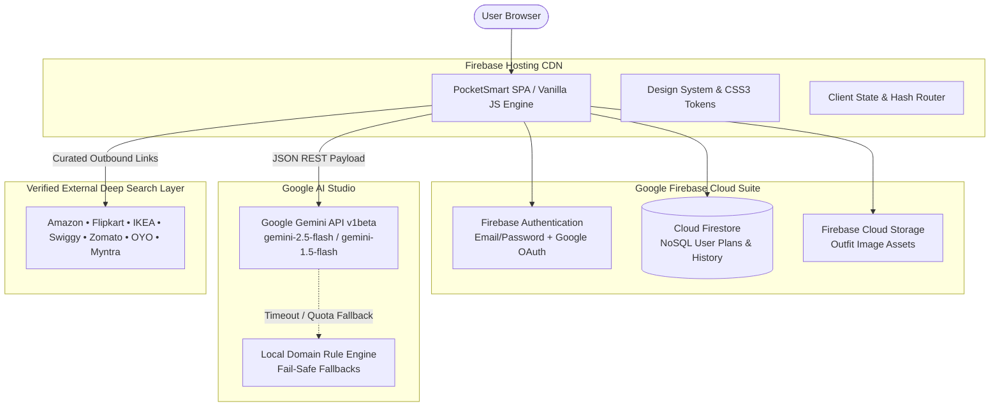

# PocketSmart AI — Architecture & Technical Design

## 1. System Overview

PocketSmart AI is an intelligent, budget-aware recommendation assistant designed to help users budget effectively across Home Interior Planning, Event & Party Planning, and Jewelry Styling.

The application uses a **100% Firebase Cloud-Native Architecture** that eliminates server maintenance, Docker containers, and backend cold starts while providing instantaneous global CDN delivery and real-time data persistence.



---

## 2. Core Architectural Layers

### 2.1 Presentation & Routing Layer (`public/index.html`, `public/css/spa.css`)
- **Single Page Application (SPA)**: Lightweight vanilla JavaScript architecture with zero heavy framework runtime overhead.
- **Client-Side Hash Routing**: Handles `#landing`, `#dashboard`, `#home`, `#party`, `#jewelry`, `#results`, and `#history` without page reloads.
- **Responsive Layout**: Designed for mobile browsers (iOS/Android), tablets, laptops, and ultra-wide desktop monitors.
- **Print & PDF Engine**: Custom `@media print` stylesheet optimized for exporting clean client-ready budget reports.

### 2.2 Application State & Controller Layer (`public/js/app.js`)
- Manages authenticated sessions, form submissions, dynamic room builders, stepper counters, and category filters.
- Orchestrates plan lifecycle: **Create &rarr; Validate &rarr; Generate &rarr; Render &rarr; Persist &rarr; Reuse**.

### 2.3 AI Recommendation & Validation Service (`public/js/gemini-service.js`)
- Directly interfaces with Google Generative Language REST endpoints.
- Implements cascade model fallback (`gemini-2.5-flash` &rarr; `gemini-1.5-flash` &rarr; `gemini-2.0-flash`).
- **Strict JSON Schema Enforcement**: Enforces structured JSON output matching domain budgets.
- **Client-Side Arithmetic Verification**: Mathematically verifies `total_estimated_cost = sum(item prices)` and `remaining_budget = budget - total_estimated_cost`.

### 2.4 Cloud Persistence Layer (`public/js/firebase-config.js`)
- **Firebase Authentication**: Native Google OAuth popup and email/password sign-in.
- **Cloud Firestore**: Stores user profiles and itemized plan histories under collection `/recommendations/{planId}`.
- **Firebase Storage**: Stores uploaded outfit photographs with secure URL generation.

---

## 3. Data Models (Cloud Firestore Schema)

### Collection: `users/{userId}`
```json
{
  "uid": "a1b2c3d4e5",
  "email": "user@example.com",
  "displayName": "Alex Sharma",
  "created_at": "2026-10-03T18:30:00.000Z",
  "preferences": {
    "default_currency": "INR",
    "budget_tier": "balanced"
  }
}
```

### Collection: `recommendations/{planId}`
```json
{
  "id": "rec_987654",
  "user_id": "a1b2c3d4e5",
  "planner_type": "home",
  "title": "Modern Minimalist Living Room Plan",
  "budget": 50000,
  "total_estimated_cost": 43500,
  "remaining_budget": 6500,
  "allocation": [
    { "category": "Furniture", "allocated_budget": 28000, "percentage": 56 },
    { "category": "Lighting & Electrical", "allocated_budget": 8500, "percentage": 17 },
    { "category": "Decor & Curtains", "allocated_budget": 7000, "percentage": 14 }
  ],
  "recommendations": [
    {
      "name": "3-Seater High-Density Fabric Sofa",
      "category": "Furniture",
      "estimated_price": 24000,
      "platform": "Amazon",
      "search_url": "https://www.amazon.in/s?k=3-Seater%20High-Density%20Fabric%20Sofa",
      "reason": "Durable stain-resistant upholstery matching contemporary neutral tones."
    }
  ],
  "savings_suggestions": [
    "Opt for energy-efficient warm LED combo fixtures to save 20% on lighting."
  ],
  "input_data": {
    "room_type": "Living Room",
    "lights_count": 4,
    "fans_count": 1,
    "sofa_requirement": "3-Seater",
    "style_preference": "Modern Minimalist"
  },
  "created_at": "2026-10-03T18:35:00.000Z"
}
```

---

## 4. Key Advantages of the Firebase Cloud-Native Architecture

1. **Zero Cold Starts**: Static assets are served from Google's global CDN Edge locations with sub-100ms first-contentful paint.
2. **Infinite Auto-Scaling**: Handles traffic spikes without requiring server instance provisioning or container sizing.
3. **Low Maintenance Cost**: Eliminates container hosting fees and dedicated VM running costs.
4. **Enhanced Reliability**: Client-side domain fail-safes guarantee that the user interface never displays a broken state even during upstream network dropouts.
